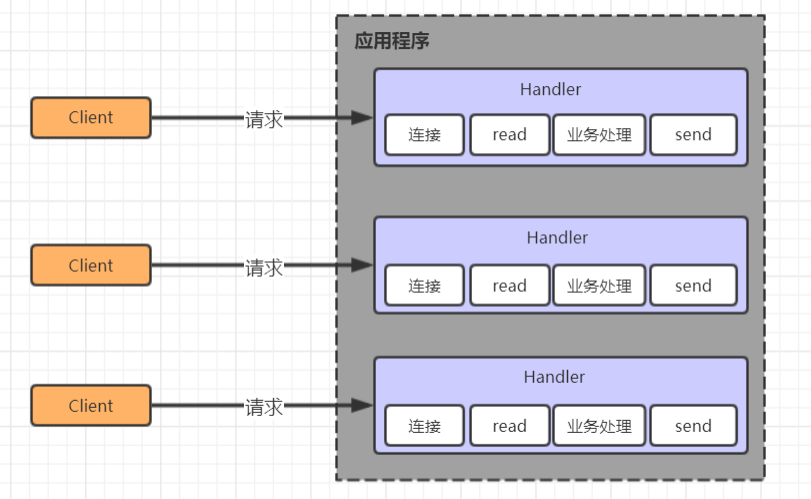
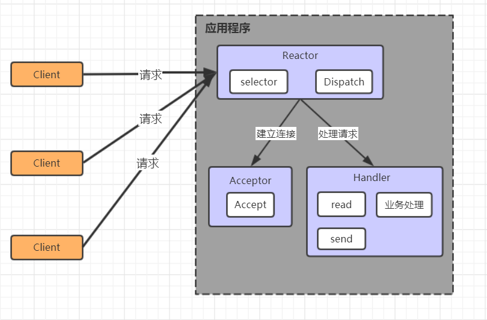
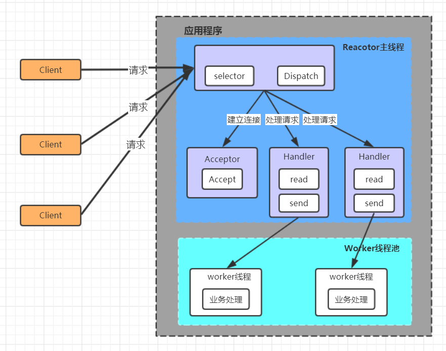
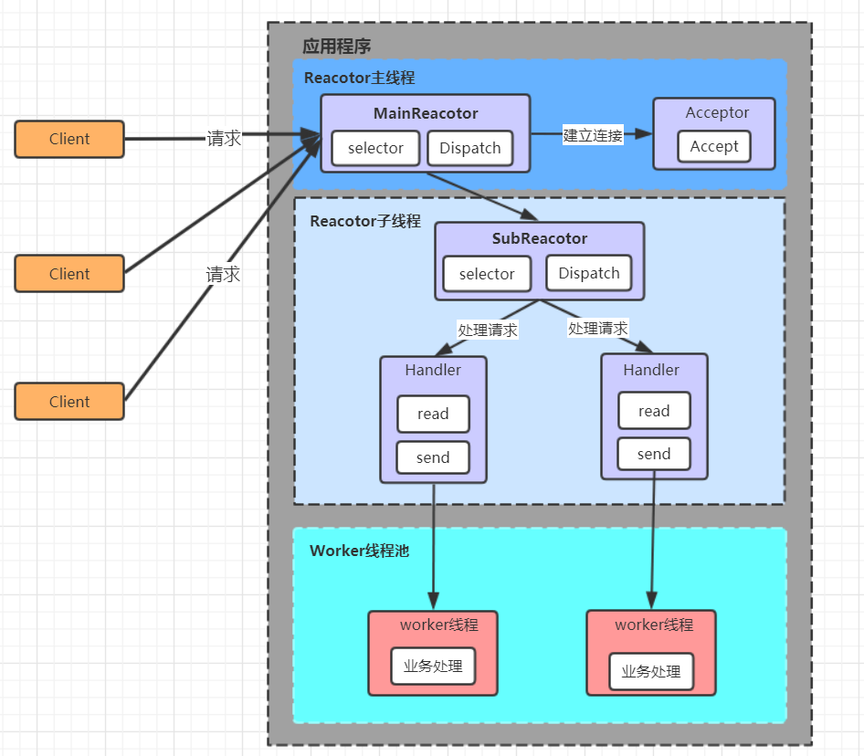

# 线程模型介绍

## 传统阻塞 I/O 服务模型

- 采用阻塞 IO 模式获取输入的数据，每个连接都需要独立的线程完成数据的输入，业务处理和数据返回工作。
  

### 存在问题

- 当并发数很大，就会创建大量的线程，占用大量系统资源
- 连接创建后，如果当前线程暂时没有数据可读，该线程会阻塞 read 操作，造成线程资源浪费

## Reactor 模型

- Reactor 模式，通过一个或者多个输入同时传递给服务器处理的模式，服务器端程序处理传入的多个请求，并将它们同步分派到相应的处理程序，因此 Reactor 模式也叫 Dispatcher 模式。Reactor 模式使用 IO 复用监听事件，收到事件后，分发给某个线程（进程），这点就是网络服务器高并发处理的关键。

### 单 Reactor 单线程

- Selector 是可以实现应用程序通过一个阻塞对象监听多路连接请求
- Reactor 对象通过 Selector 监控客户端请求事件，收到事件后通过 Dispatch 进行转发
- 建立连接请求事件，由 Acceptor 通过 Accept 处理连接请求，然后创建一个 Handler 对象处理连接完成后的后续业务处理
- Handler 会完成 Read --> 业务出路 --> Send 的完整业务流程

#### 优点

- 模型简单，没有多线程、进程通信、竞争的问题。全部都在一个线程中完成

#### 缺点

- 性能问题
    - 只有一个线程，无法完全发挥多核 CPU 的性能。Handler 在处理某个连接上的业务时，整个进程无法处理其它连接时间，很容易导致性能瓶颈
- 可靠性问题
    - 线程意外终止或者进入死循环，会导致整个系统通信模块不可用，不能接受和处理外部消息，造成节点故障

### 单 Reactor 多线程

- Reactor 对象通过 Selector 监控客户端请求事件，收到事件后，通过 dispatch 进行分发
- 如果建立连接请求，则右 Acceptor 通过 accept 处理连接请求
- 如果不是连接请求，则由 reactor 分发调用连接对应的 handler 来处理
- handler 只负责响应事件，不做具体的业务处理，通过 Read 读取数据后，会分发给后面的 worker 线程池中的某个线程处理业务
- worker 线程池会分配独立线程完成真正的业务，并将结果返回给 handler
- handler 收到响应后，通过 send 将结果返回给 client

#### 优点

- 可以充分地利用多核 cpu 的处理能力

#### 缺点

- 多线程数据共享和访问比较复杂，reactor 处理所有的时间的监听和响应，在单线程运行，在高并发场景容易出现性能瓶颈

### 主从 Reactor 多线程

- Reactor 主线程 MainReactor 对象通过 select 监听客户端连接事件，收到事件后，通过 Acceptor 处理客户端连接事件
- 当 Acceptor 处理客户端连接事件之后（与客户端建立好 Socket 连接），MainReactor 将连接分配给 SubReactor。（即：MainReactor 只负责监听客户端连接请求，和客户端建立连接之后将交由 SubReactor 监听后面的 IO 事件）
- SubReactor 将连接加入到自己的连接队列进行监听，并创建 Handler 对各种事件进行处理
- 当连接上有新事件发生的时候，SubReactor 就会调用对应的 Handler 处理
- Handler 通过 read 从连接上读取请求数据，将请求数据分发给 Worker 线程池进行业务处理
- Worker 线程池会分配独立线程来完成真正的业务处理，并将处理结果返回给 Handler。Handler 通过 send 向客户端发送响应数据
- 一个 MainReactor 可以对应多个 SubReactor，即一个 MainReactor 线程可以对应多个 SubReactor 线程

#### 优点

- MainReactor 线程与 SubReactor 线程的数据交互简单职责明确，MainReactor 线程只需要接受新连接，SubReactor 线程完成后续的业务处理
- MainReactor 线程与 SubReactor 现成的数据交互简单，MainReactor 线程只需要把新连接传给 SubReactor 线程，SubReactor 线程无需返回数据
- 多个 SubReactor 线程能够应对更高的并发请求

#### 缺点

- 这种模式的缺点是编程复杂度较高，但是由于其优点明显，在许多项目中被广泛使用，包括 Nginx、Memcached、Netty 等。这种模式也被叫做服务器的 1+ M + N 线程模式，即使用该模式开发的服务器包含一个（或多个，1 只是表示相对较少）连接建立线程 + M 个 IO 线程 + N 个业务处理线程。这是业界成熟的服务器程序设计模式