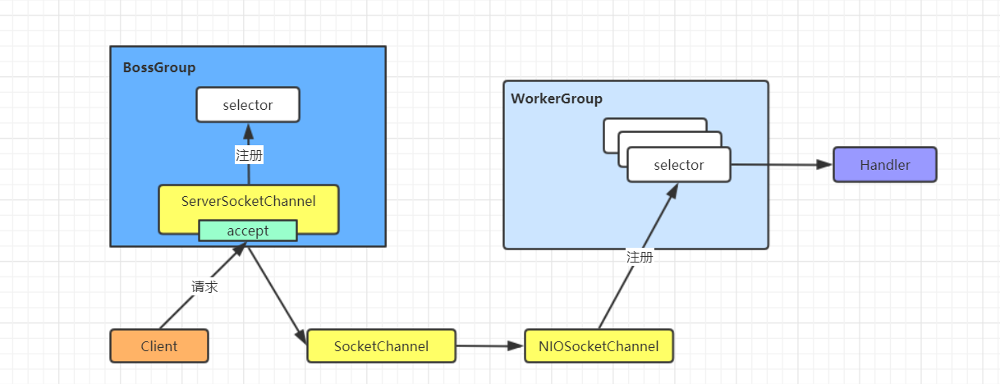
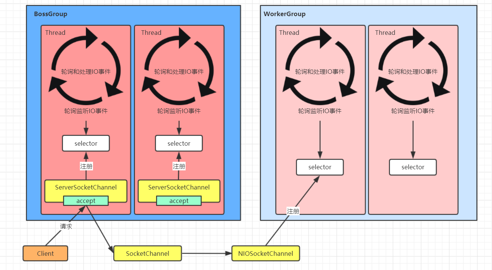
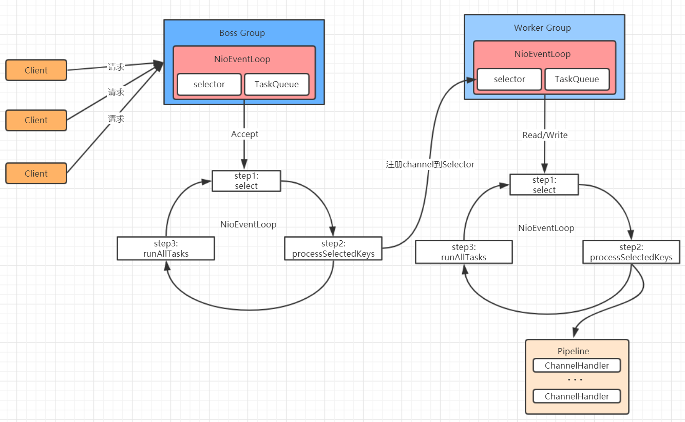

# Netty 线程模型

- Netty 的设计主要基于主从 Reactor 多线程模式，并做了一定的改进

## 简单版 Netty 模型

- BossGroup 线程维护 Selector， ServerSocketChannel 注册到这个 Selector 上，只关注连接建立请求时间（主 Reactor）
- 当接收到来自客户端的连接建立请求事件的时候，通过 ServerSocketChannel.accept 获得对应的 SocketChannel，并封装成 NIOSocketChannel 注册到 WorkerGroup 线程中的 Selector，每个 Selector 运行到一个线程中（从 Reactor）
- 当 WorkerGroup 线程中的 Selector 监听到自己感兴趣的 IO 事件后，就调用 Handler 进行处理

## 进阶版 Netty 模型

- 有两组线程池：BossGroup 和 WorkerGroup，BossGroup 中的线程专门负责和客户端建立连接，WorkerGroup 中的线程专门负责处理连接上的读写
- BossGroup 和 WorkerGroup 含有多个不断循环的执行事件处理的线程，每个线程都包含一个 Selector，用于监听注册在其上的 Channel
- 每个 BossGroup 中的线程循环执行以下三个步骤
    - 轮询注册在其中的 ServerSocketChannel 的 accept 时间（OP_ACCPET 事件）
    - 处理 accept 事件，与客户端建立连接，生成一个 NIOSocketChannel，并将其注册到 WorkerGroup 中某个线程上的 Selector 上
    - 再去以此循环处理任务队列中的下一个事件
- 每个 WorkerGroup 中的线程循环执行以下三个步骤
    - 轮询注册在其中的 NIOSocketChannel 的 read/write 事件（OP_READ/OP_WRITE 事件)
    - 在对应的 NIOSocketChannel 上处理 read/write 事件
    - 再去依次循环处理任务队列中的下一个事件

## 详细版 Netty 模型

- Netty 抽象出两组线程池：BossGroup 和 WorkerGroup，也可以叫做 BossNioEventLoopGroup 和 WorkerNioEventLoopGroup。每个线程池中都有 NioEventLoop 线程。BossGroup 中的线程专门负责和客户端建立连接，WorkerGroup 中的线程专门负责处理连接上的读写。BossGroup 和 WorkerGroup 的类型都是 NioEventLoopGroup
- NioEventLoopGroup 相当于一个事件循环组，这个组中含有多个事件循环，每个事件循环就是一个 NioEventLoop
- NioEventLoop 表示一个不断循环的执行事件处理的线程，每个 NioEventLoop 都包含一个 Selector，用于监听注册在其上的 Socket 网络连接（Channel）
- NioEventLoopGroup 可以含有多个线程，即可以含有多个 NioEventLoop
- 每个 BossNioEventLoop 中循环执行以下三个步骤
    - select：轮询注册在其上的 ServerSocketChannel 的 accept 事件（OP_ACCEPT 事件）
    - processSelectorKeys：处理 accpet 时间，与客户端建立连接，生成一个 NIOSocketChannel，并将其注册到某个 WorkerNioEventLoop 上的 Selector 上
    - runAllTasks：再去以此循环处理任务队列中的其他任务
- 每个 WorkerNioEventLoop 中循环执行以下三个步骤
    - select：轮询注册在其上的 NIOSocketChannel 的 read/write 事件（OP_READ/OP_WRITE 事件）
    - processSelectorKeys：在对应的 NIOSocketChannel 上处理 read/write 事件
    - runAllTasks：再去以此循环处理任务队列中的其他任务
- 在以上两个 processSelectorKeys 步骤中，会使用 Pipeline（管道），Pipeline 中引用了 Channel，即通过 Pipeline 可以获取到对应的 Channel，Pipeline 中维护了很多的处理器（拦截处理器、过滤处理器、自定义处理器等）