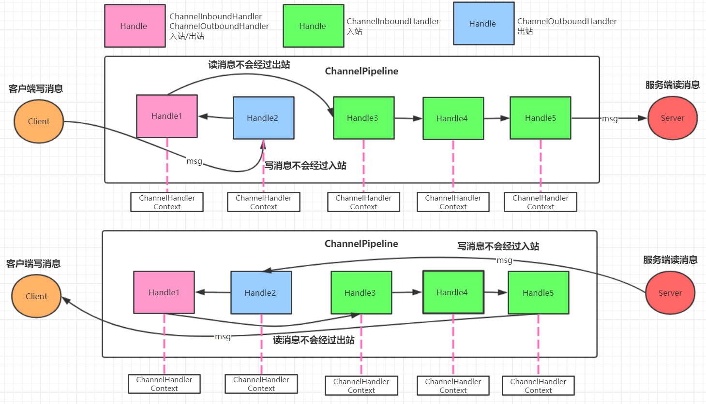
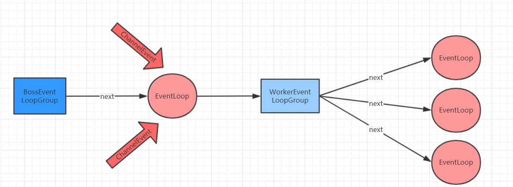

# Netty 核心 API

## ChannelHandler 及其实现类

- Netty 开发中需要自定义一个 Handler 类去实现 ChannelHandler 接口或者子接口或其实现类，然后通过重写相应方法实现业务逻辑，我们接下来看看一般都需要重写哪些方法
    - `public void channelActive(ChannelHandlerContext ctx)`，通道就绪事件
    - `public void channelRead(ChannelHandlerContext ctx, Object msg)`，通道读取数据事件
    - `public void channelReadComplete(ChannelHandlerContext ctx)`，数据读取完毕事件
    - `public void exceptionCaught(ChannelHandlerContext ctx, Throwable cause)`，通道发生异常事件

## ChannelPipeline

- ChannelPipeline 是一个 Handler 的集合，它负责处理和拦截 inbound 或者 outbound 的事件和操作，相当于一个贯穿 Netty 的责任链
- 如果客户端和服务器的 Handler 是一样的，消息从客户端到服务端或者反过来，每个 Inbound 类型或者 Outbound 类型的 Handler 只会经过一次，混合类型的 Handler（实现了 Inbound 和 Outbound 的 Handler）会经过两次。准确的说 ChannelPipeline 中是一个 ChannelHandlerContext，每个上下文对象中有 ChannelHandler。InboundHandler 是按照 Pipeline 的加载顺序的顺序执行，OutboundHandler 是按照 Pipeline 的加载顺序，逆序执行

## ChannelHandlerContext

- 这是事件处理器上下文对象，Pipeline 链中的实际处理节点。每个处理节点 ChannelHandlerContext 中包含一个具体的事件处理器 ChannelHandler，同时 ChannelHandlerContext 中也绑定了对应的 ChannelPipeline 和 Channel 的信息，方便对 ChannelHandler 进行调用。常用的方法如下：
    - ChannelOption.SO_BACKLOG
        - 对应 TCP/IP 协议 listen 函数中的 backlog 参数，用来初始化服务器可连接队列大小。服务端处理客户端连接请求时顺序处理的，所以同一时间只能处理一个客户端连接。多个客户端来的时候，服务端将不能处理的客户端连接请求放在队列中等待处理，backlog 参数指定了队列的大小
    - ChannelOption.SO_KEEPALIVE
        - 一直保持连接活动状态。该参数用于设置 TCP 连接，当设置该选项以后，连接会测试链接的状态，这个选项用于可能长时间没有数据交流的连接。当设置该选项以后，如果在两小时内没有数据的通信时，TCP 会自动发送一个活动探测数据报文

## ChannelFuture

- 表示 Channel 中异步 I/O 操作的结果，在 Netty 中所有的 I/O 操作都是异步的，I/O 的调用会直接返回，调用者并不能立刻获得结果，但是可以通过 ChannelFuture 来获取 I/O 操作的处理状态。常用方法如下所示：
    - Channel channel()，返回当前正在进行 IO 操作的通道
    - ChannelFuture sync()，等待异步操作执行完毕，将异步改为同步

## EventLoopGroup 和实现类 NioEventLoopGroup

- EventLoopGroup 是一组 EvenetLoop 的抽象，Netty 为了更好地利用多核 CPU 资源，一般会有多个 EventLoop 同时工作，每个 EventLoop 维护者一个 Selector 实例
- EventLoopGroup 提供 next 接口，可以从组里面按照一定规则获取其中一个 EventLoop 来处理任务。在 Netty 服务端编程中，我们一般都需要提供两个 EventLoopGroup，例如：BOSSEventLoopGroup 和 WorkerEventLoopGroup。通常一个服务端口即一个 ServerSocketChannel 对应一个 Selector 和一个 EventLoop 线程。BossEventLoop。通常一个服务端口即一个 ServerSocketChannel 对应一个 Selector 和一个 EventLoop 线程。 BossEventLoop 负责接收客户端的连接并将 SocketChannel 交给 WorkerEventLoopGroup 来进行 IO 处理，如下图所示：
  
- BossEventLoopGroup 通常是一个单线程的 EventLoop， EventLoop 维护者一个注册了 ServerSocketChannel 的 Selector 实例， BossEventLoop 不断轮询 Selector 将连接事件分离出来，通常是 OP_ACCEPT，然后将接收到的 SocketChannel 交给 WorkerEventLoopGroup，WorkerEventLoopGroup 会由 next 选择其中一个 EventLoopGroup 来将这个 SocketChannel 注册到其维护的 Selector 并对其后续的 IO 事件进行处理
- 一般情况下我们都是用实现类 NioEventLoopGroup
- 常用方法如下所示
    - `public NioEventLoopGroup()`，构造方法，创建线程组
    - `public Future<?> shutdownGracefully()`，断开连接，关闭线程

## ServerBootStrap 和 BootStrap

- ServerBootstrap 是 Netty 中的服务器端启动助手，通过它可以完成服务器端的各种配置；Bootstrap 是 Netty 中的客户端启动助手，通过它可以完成客户端的各种配置。常用方法如下所示：
    - `public ServerBootstrap group(EventLoopGroup parentGroup, EventLoopGroupchildGroup)`， 该方法用于服务器端，用来设置两个 EventLoop
    - `public B group(EventLoopGroup group)` ，该方法用于客户端，用来设置一个 EventLoop
    - `public B channel(Class<? extends C> channelClass)`，该方法用来设置一个服务器端的通道 实现
    - `public B option(ChannelOption option, T value)`，用来给 ServerChannel 添加配置
    - `public ServerBootstrap childOption(ChannelOption childOption, T value)`，用来给接收到的通道添加配置
    - `public ServerBootstrap childHandler(ChannelHandler childHandler)`，该方法用来设置业务处理类（自定义的 handler)
    - `public ChannelFuture bind(int inetPort)` ，该方法用于服务器端，用来设置占用的端口号
    - `public ChannelFuture connect(String inetHost, int inetPort)` ，该方法用于客户端，用来连接服务器端

## Unpooled 类

- 这是 Netty 提供的一个专门用来操作缓冲区的工具类，常用方法如下所示：
    - `public static ByteBuf copiedBuffer(CharSequence string, Charset charset)`，通过给定的数据和字符编码返回一个 ByteBuf 对象（类似于 NIO 中的 ByteBuffer 对象）