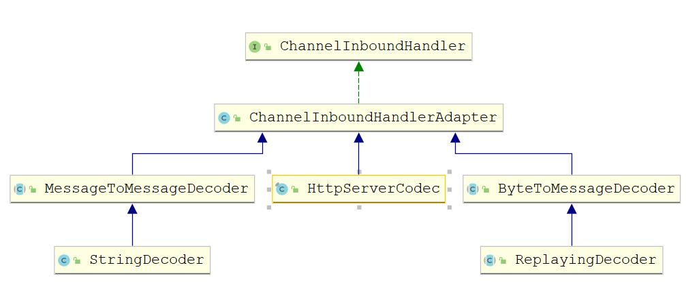
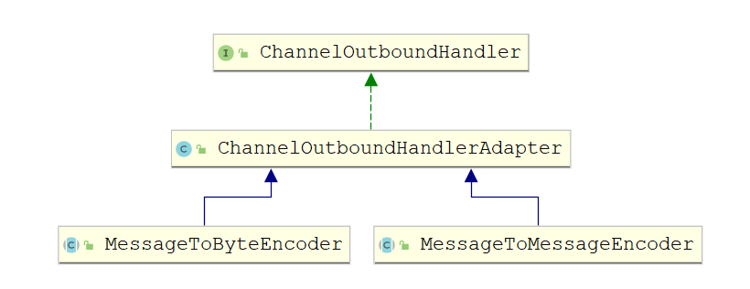
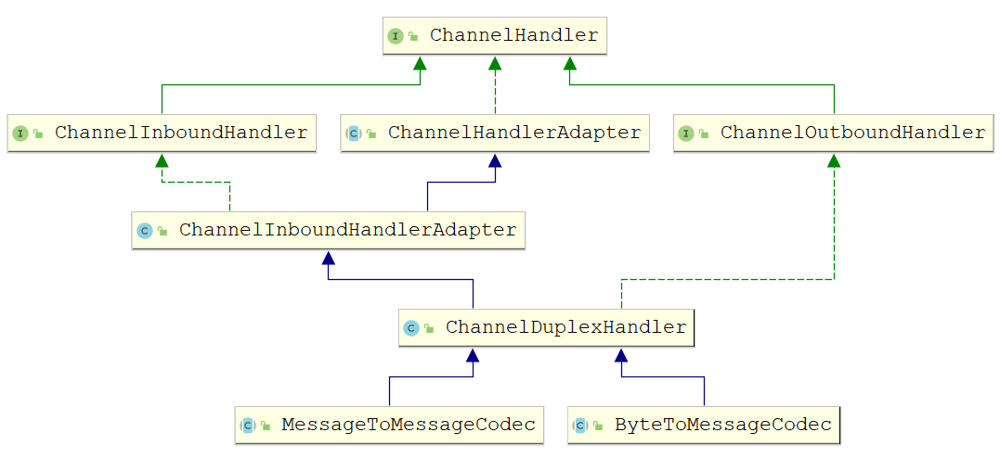

# Netty 编解码器

## Java 的编解码

- Java 序列化对象只需要实现 java.io.Serializable 接口并生成序列化 ID，这个类就能够通过 java.io.ObjectInput 和 java.io.ObjectOutput 序列化和反序列化
- Java 序列化的目的
    - 网络传输
    - 对象持久化
- Java 序列化缺点
    - 无法跨语言
    - 序列化后码流太大
    - 序列化性能太低
- Java 序列化仅仅是 Java 编解码技术的一种，由于它的种种缺陷，衍生了多种编解码技术和框架，这种编解码框架实现消息的高效序列化

### 编码（Encode）

- 也称为序列化，它将对象序列化化为字节数组，用于网络传输、数据持久化或者其它用途

### 解码（Decode）

- 也称为反序列化，它把从网络，磁盘等读取的字节数组还原成原始对象（通常是原始对象的拷贝），以方便后续的业务逻辑操作

## Netty 编解码器

### 概念

- 在网络应用中需要实现某种编解码器，将原始字节数据与自定义的消息进行相互转换。网络中都是以字节码的数据形式来传输数据的，服务器编码数据后发送到客户端，客户端需要对数据进行解码
- 对于 Netty 来说，编解码器由两部分组成：编码器、解码器
    - 编码器：负责将消息从字节或其他序列形式转成指定的消息对象
    - 编码器：将消息对象转成自己或其他序列形式在网络上传输
- Netty 的编（解）码实现了 ChannelHandlerAdapter，也是一种特殊的 ChannelHandler，所以依赖于 ChannelPipeline，可以将多个编（解）码器链接在一起，以实现复杂的转换逻辑
- Netty 里面的编解码
    - 解码器：负责处理“入栈 InboundHandler”的数据。编码器：负责“出栈 OutboundHandler”数据

### 解码器（Decoder）

- 解码器负责解码“入栈”数据从一种格式到另一种合适，解码器处理入栈数据是抽象 ChannelInboundHandler 的实现。需要将解码器放在 ChannelPipeline 中。对于解码器，Netty 中主要提供了抽象类基类 ByteToMessageDecoder 和 MessageToMessageDecoder



#### 抽象解码器

- ByteToMessageDecoder：用于将字节转为消息，需要检查缓冲区是否有足够的字节
- ReplayingDecoder：继承 ByteToMessageDecoder，不需要检查缓冲区是否有足够的字节，但是 ReplayingDecoder 速度略慢于 ByteToMessageDecoder，同时不是所有的 ByteBuf 都支持。项目复杂性高则使用 ReplayingDecoder，否则使用 ByteToMessageDecoder
- MessageToMessageDecoder：用于从一种消息解码为另一种消息（例如 POJO 到 POJO）
- 核心方法

```java
decode(ChannelHandlerContext ctx, ByteBuf msg, List<Object> out)
```

### 编码器（Encoder）

- 与 ByteToMessageDecoder 和 MessageToMessageDecoder 相对应，Netty 提供了对应的编码器实现 MessageToByteEncoder 和 MessageToMessageEncoder，二者都实现 ChannelOutboundHandler 接口



#### 抽象编码器

- MessageToByteEncoder：将消息转化成字节
- MessageToMessageEncoder：用于从一种消息编码为另一种消息编码（例如 POJO 到 POJO）
- 核心方法

```java
encode(ChannelHandlerContext ctx, String msg, List<Object> out)
```

### 编码解码器 Codec

- 编码解码器：同时具有编码与解码功能，特点同时实现了 ChannelInboundHandler 和 ChannelOutboundHandler 接口，因此在数据输入和输出时都能进行处理



- Netty 提供了一个 ChannelDuplexHandler 适配器类，编码解码器的抽象基类 ByteToMessageCodec，MessageToMessageCodec 都继承于此类