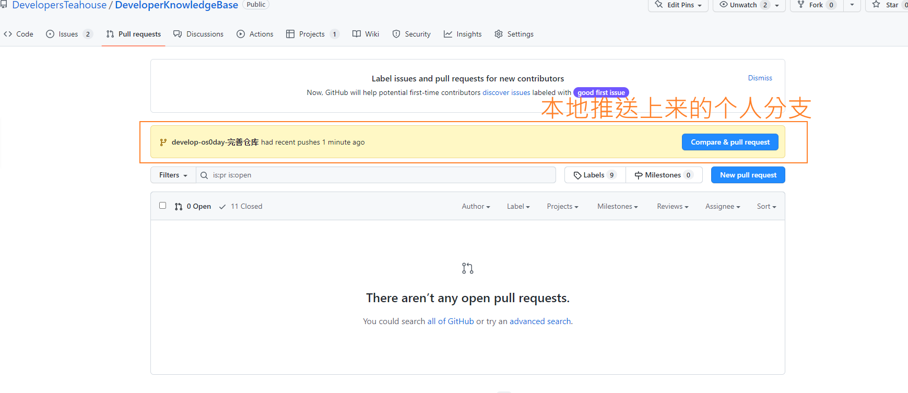
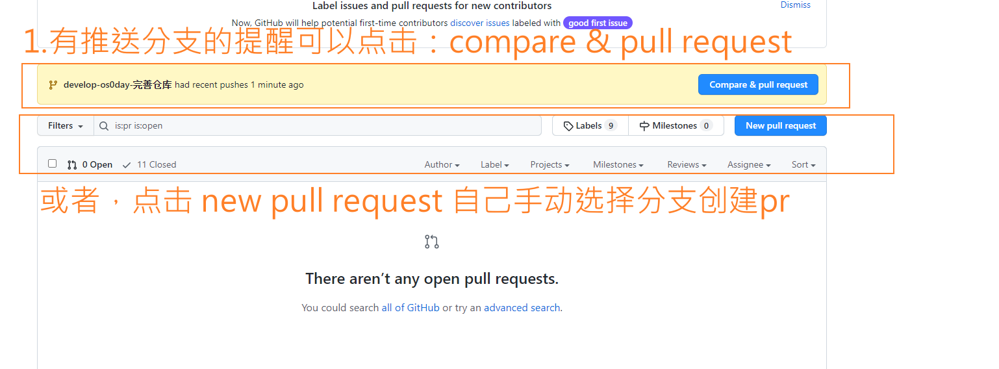
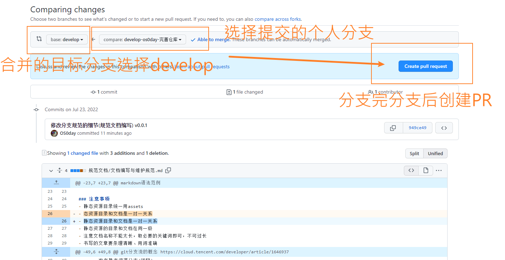
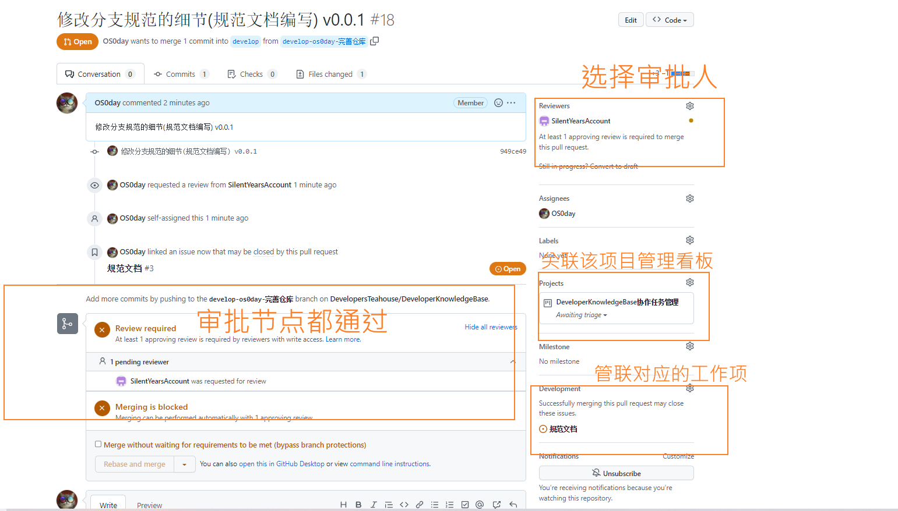
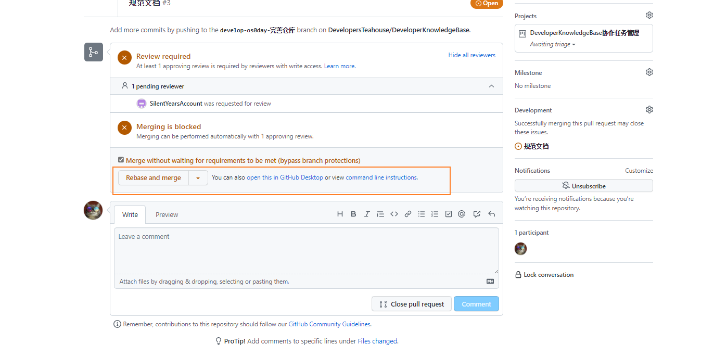

## 1.书写规范

### 范例
markdown语法范例
```
# 文章名称
#标签一 #标签二

## 一、一级标题

### 1.1 二级标题

#### 1.1.1 三级标题

##### (1) 四级标题

# 本文引用文献
- www.DevelopersTeahouse.cn/12312312
- www.DevelopersTeahouse.cn/12312312

```

### 注意事项
- 静态资源目录统一用assets
- 静态资源目录和文档是一对一关系
- 静态资源的目录和文档在同一级
- 注意文档名称不能太长，取必要的关键词即可，不可过长
- 书写的文章要条理清晰、用词准确

例如以下结构:
```
   src/
        Java/
            assets/
                    图片等静态资源
            Java.md
```

## 2.分支管理

### 注意事项

git分支流的概念 https://cloud.tencent.com/developer/article/1646937

- 采用Gitlab flow，分支合并都采用变基进行操作即rebase, 不使用合并merge操作
- main 主分支 用于发布使用
- develop 开发分支
- pages 发布静态资源分支(预留)
- 个人分支：`develop-用户名-任务名称`  eg： develop-os0day-Java基础知识汇总   
- 用个人分支进行推送，每次推送新的提交都需要拉取一次pr进行审核，审核完后变基合并到develop分支
- 分支备注格式：`提交的内容的概括(备注具体的任务项)  迭代版本号 ` , eg： 修改分支规范的细节(规范文档编写) v0.0.1
- 所提分支要关联对应的工作项

### 范例
- 推送个人分支后，在Pr界面可以看到提醒，然后点击创建pr

- 创建pr的方式

- 选择通用的方式 new pull request，来创建pr 点击create pull request
- 注意选择提交的个人分支，目标分支是develop，

- 写pr注释

- 创建pr之后需要选择关联的东西
- 
- 所有审批节点通过后点击 rebase and merge 会自动变基合并分支，正常情况下
- 没有出现冲突，会删除推送的个人分支


## 3.迭代管理
项目看板路径: https://github.com/DevelopersTeahouse/DeveloperKnowledgeBase/projects/1
- 以项目看板来分配迭代工作
- 两周为一个迭代
- 一个迭代会有若干个任务，任务的多少由工作量来限定
- 迭代中期需要汇报迭代工作进度，迭代deadline时间需要对工作任务进行整理以便于制定后续迭代的工作
- 原则上不能让过多的迭代工作延期，所以，每个迭代任务都需要量力而行
